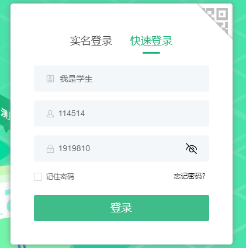
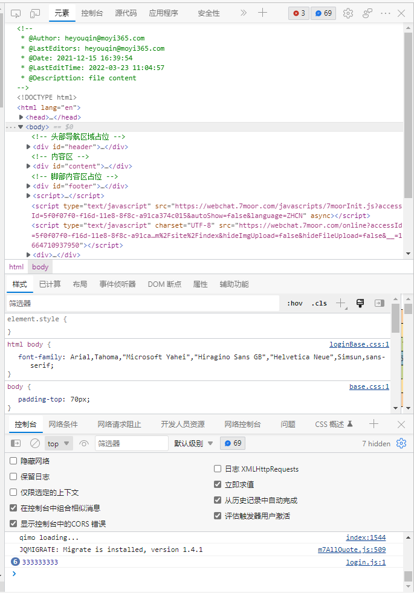
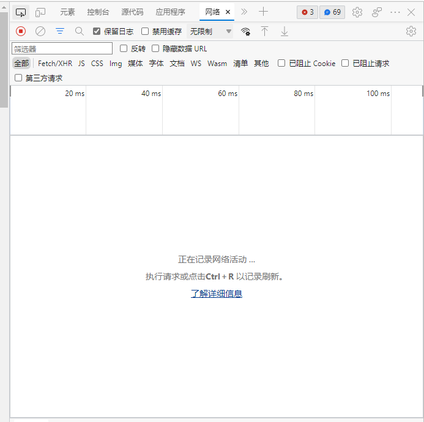
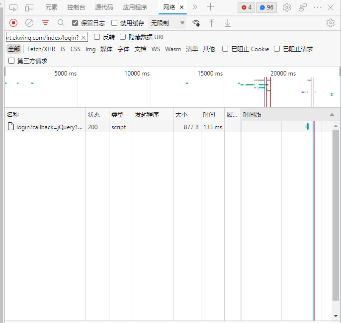

# EkwingFucker
### 使用教程


准备：

你的翼课号([登陆后点击这里查看](https://www.ekwing.com/uc/info))

一个chormiun内核的浏览器(Edge,Google Chorme等)

---
现在 [点击这里退出登录](https://www.ekwing.com/login/logout)

点击快速登录 选择我是学生 输入你的翼课号 密码


按下F12,打开开发者工具


点击 ```网络 或 Network``` 没有的话藏在图中安全性右边的```》```图标里 点一下就有了


点击```筛选器 或 Fillter``` 输入```passport.ekwing.com/index/login?```

点击 ```保留日志``` 与 ```左边第二个按钮 清楚```

点击翼课网界面中的登录

此时你的开发者工具中应该有一个请求  

(就是名称下面这个login开头的)

对着它右键-复制-复制链接地址    

此时 你就获得了翼课网的登录链接

将他填入```config.json```中的```login```后面的双引号里面
``` 
{
    "login":"***这里***",
    "exam":"https://www.ekwing.com/exam/student/getexamlist?page=1&type=2&mode_type=1",
```

### 接入钉钉机器人

在群里添加机器人 使用关键词过滤 添加关键词FuckEkwing

将webhook填入```config.json```即可